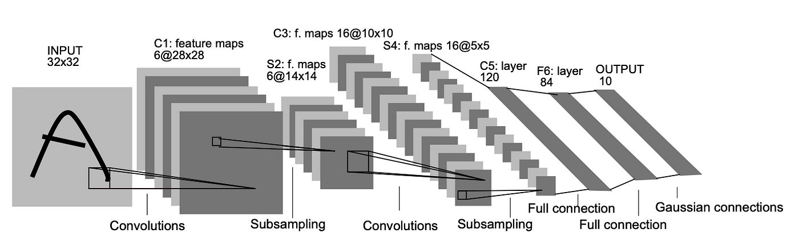

# CNNs-for-Image-Classification

This repository contains a PyTorch implementation of the LeNet-5 neural network architecture for image classification on the MNIST dataset.


## Table of Contents

- [Introduction](#introduction)
- [Model Architecture](#model-architecture)
- [Installation](#installation)
- [Usage](#usage)
  - [Training](#training)
- [Early Stopping](#early-stopping)
- [Contributing](#contributing)

## Introduction

LeNet-5 is a convolutional neural network architecture designed by Yann LeCun et al. It is primarily used for handwritten digit recognition (MNIST dataset). This implementation demonstrates how to use PyTorch to train and evaluate LeNet-5.

You can read the paper here:

[http://vision.stanford.edu/cs598_spring07/papers/Lecun98.pdf](http://vision.stanford.edu/cs598_spring07/papers/Lecun98.pdf)

## Model Architecture



LeNet-5 consists of the following layers:

1. Convolutional Layer (C1): 6 filters of size 5x5
2. Subsampling Layer (S2): Average pooling with a 2x2 filter
3. Convolutional Layer (C3): 16 filters of size 5x5
4. Subsampling Layer (S4): Average pooling with a 2x2 filter
5. Fully Connected Layer (C5): 120 neurons
6. Fully Connected Layer (F6): 84 neurons
7. Output Layer: 10 neurons (one for each class)

## Installation

To use this code, clone the repository and install the required packages.

```bash
git clone https://github.com/nicholasbaard/CNNs-for-Image-Classification.git
cd CNNs-for-Image-Classification
pip install -r requirements.txt
```

## Usage

### Training

To train the LeNet-5 model on the MNIST dataset, run the following command:

```bash
python main.py
```

### Options

- `--batch_size`: Batch size for training (default: 32)
- `--learning_rate`: Learning rate for the optimizer (default: 1e-3)
- `--epochs`: Number of epochs to train for (default: 10)
- `--gamma`: Gamma value for the loss function (default: 0.7)
- `--save_model`: Save the trained model
- `--patience`: Patience for early stopping (default: 3)

## Early Stopping

This implementation includes early stopping to prevent overfitting. Early stopping is based on the validation loss and will stop training if the validation loss does not improve for a specified number of epochs (patience).

## Contributing

Contributions are welcome! If you find a bug or have a suggestion for improvement, please open an issue or submit a pull request.
